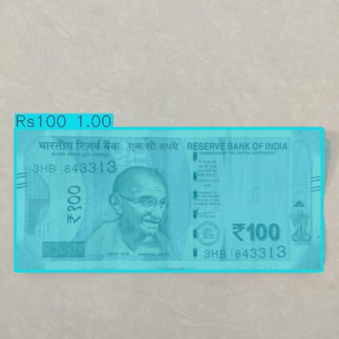

# Instance Segmentation of Indian Currency Notes 🇮🇳

> YOLOv8-seg trained on a custom-annotated dataset to detect and segment Indian currency denominations (₹10 – ₹2000) with pixel-level masks.

![Demo]

---

## Why Segmentation over Detection?

Object detection draws a bounding **box** around a note. Instance segmentation traces the **exact pixel boundary** of each note. For currency, this matters because:

- **Overlapping notes** — boxes merge; masks can separate individual notes in a pile
- **Damaged note detection** — pixel-level masks enable texture analysis on the exact note region, not background
- **Area measurement** — count exact pixels a note occupies, useful in ATM/cash-counting machines
- **Rotated notes** — masks follow the actual shape; boxes waste space on diagonal notes

---

## Dataset

**Created and contributed by this project** — no public Indian currency segmentation dataset existed.

| Property | Value |
|---|---|
| Source images | Roboflow Universe (detection dataset) |
| Annotations | Hand-annotated polygons using Roboflow Smart Polygon (SAM-based) |
| Total images | 346 (with augmentation) |
| Classes | 7 (₹10, ₹20, ₹50, ₹100, ₹200, ₹500, ₹2000) |
| Images per class | ~27 balanced |
| Split | 70% train / 20% val / 10% test |

📦 **Dataset on Roboflow Universe:** [Indian Currency Segmentation](https://universe.roboflow.com/samarths-workspace-onsk6/indian-currency-segmentation)

---

## Architecture

```
Input Image
     ↓
YOLOv8n-seg (nano)
     ↓
Bounding Box + Polygon Mask per instance
     ↓
Class label + Confidence + Mask overlay
```

**Model:** `yolov8n-seg.pt` — nano variant, fast inference, CPU-deployable  
**Training:** Google Colab (Tesla T4 GPU), 50 epochs (early stopping at patience=20)  
**Image size:** 640×640

---

## Results

### Validation Metrics

| Metric | Detection (Box) | Segmentation (Mask) |
|---|---|---|
| mAP50 | 0.995 | 0.995 |
| mAP50-95 | 0.991 | 0.994 |
| Precision | 0.991 | 0.991 |
| Recall | 1.000 | 1.000 |

### Per-Class Segmentation mAP50

| Class | mAP50 |
|---|---|
| ₹10 | 0.995 |
| ₹20 | 0.995 |
| ₹50 | 0.995 |
| ₹100 | 0.995 |
| ₹200 | 0.995 |
| ₹500 | 0.995 |
| ₹2000 | 0.995 |

---

## Demo

### Successful Detection


*Rs200 detected at 0.99 confidence with pixel-accurate mask*

### Failure Case — Overlapping Notes


*Model fails when notes overlap — masks bleed across notes instead of separating instances. Training data contained no overlapping examples. This is a known limitation.*

---

## What I Learned

- **COCO → YOLOv8 conversion** — Roboflow exports segmentation as COCO JSON; wrote custom converter to YOLOv8 polygon `.txt` format
- **Supercategory pitfall** — Roboflow adds project name as a COCO supercategory (class id 0); must filter it out before training
- **High accuracy ≠ production ready** — 99.5% mAP on clean, flat, non-overlapping notes. Real ATM scenario (stacked, worn, partial notes) would require diverse occlusion data
- **Smart Polygon tool** — SAM-based annotation in Roboflow cuts polygon annotation time from ~3 min to ~45 sec per image
- **Dataset contribution** — First public Indian currency segmentation dataset on Roboflow Universe

---

## Project Structure

```
instance-segmentation-yolo/
├── src/
│   ├── coco_to_yolo.py     # Convert COCO JSON → YOLOv8 polygon labels
│   ├── split_data.py       # Split flat dataset → train/val/test
│   ├── train.py            # YOLOv8-seg training script
│   ├── inference.py        # Run inference on image/folder
│   ├── visualize.py        # Rich mask visualization + area analysis
│   └── evaluate.py         # Print per-class metrics
├── notebooks/
│   └── train.ipynb         # Full Colab training notebook
├── data/                   # Sample images (full dataset on Roboflow)
├── demo/                   # Result GIFs and screenshots
├── requirements.txt
└── README.md
```

---

## Installation & Usage

```bash
git clone https://github.com/samy1406/instance-segmentation-yolo
cd instance-segmentation-yolo
pip install -r requirements.txt
```

### Run Inference
```bash
python src/inference.py --source path/to/image.jpg --weights path/to/best.pt
```

### Evaluate Model
```bash
python src/evaluate.py
```

### Training (Google Colab recommended)
Open `notebooks/train.ipynb` in Google Colab and follow the cells.

---

## Requirements

```
ultralytics
roboflow
numpy
matplotlib
opencv-python
```

---

## Tools & Technologies


---

## Future Work

- Collect overlapping/stacked note images for occlusion-robust training
- Test on worn, torn, and partial notes for damaged note detection
- Deploy as FastAPI endpoint with real-time webcam inference
- Benchmark `yolov8s-seg` vs `yolov8m-seg` for accuracy vs speed tradeoff
- Export to ONNX for CPU edge deployment